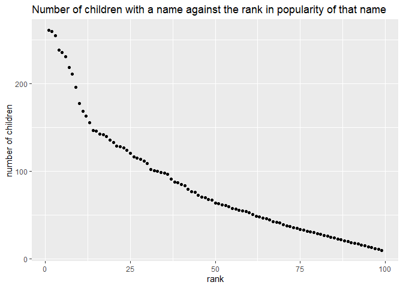

p8105\_hw2\_yj2580
================
yj2580
9/25/2019

## Problem 1

``` r
# Create a dataframe from the Mr. Trash Wheel sheet
trash_df = read_excel("./data/Trash-Wheel-Collection-Totals-8-6-19.xlsx", sheet = 1)%>%
#clean names, make variable names reasonable
  janitor::clean_names() %>%
#omit non data entries
  select(-x15, -x16, -x17) %>%
#omit rows that do not include dumpster-specific data
  drop_na(dumpster)  %>%
#round the number of sports balls and transfer them into integers
  mutate(sports_balls = as.integer(round(as.numeric(sports_balls))))
```

    ## New names:
    ## * `` -> ...15
    ## * `` -> ...16
    ## * `` -> ...17

``` r
#Create a dataframe of precipitation data for 2018
pre2018_df = read_excel("./data/HealthyHarborWaterWheelTotals2018-7-28.xlsx", sheet = 3, range = "A2:B14") %>%
  janitor::clean_names() %>%
#add a variable year, convert month to a character variable
  mutate(year = "2018",
         month = month.name)  %>%
#omit rows without precipitation data
  drop_na()

#Create a dataframe of precipitation data for 2017
pre2017_df = read_excel("./data/HealthyHarborWaterWheelTotals2018-7-28.xlsx", sheet = 4, range = "A2:B14") %>%
  janitor::clean_names() %>%
#add a variable year,convert month to a character variable
  mutate(year = "2017",
         month = month.name)  %>%
#omit rows without precipitation data
  drop_na()

#combine precipitation datasets
pre_df = rbind(pre2017_df, pre2018_df)
```

Comments: In the Mr. Trash Wheel, we can see the summary of variables
from this
    table:

    ## Classes 'tbl_df', 'tbl' and 'data.frame':    344 obs. of  14 variables:
    ##  $ dumpster          : num  1 2 3 4 5 6 7 8 9 10 ...
    ##  $ month             : chr  "May" "May" "May" "May" ...
    ##  $ year              : num  2014 2014 2014 2014 2014 ...
    ##  $ date              : POSIXct, format: "2014-05-16" "2014-05-16" ...
    ##  $ weight_tons       : num  4.31 2.74 3.45 3.1 4.06 2.71 1.91 3.7 2.52 3.76 ...
    ##  $ volume_cubic_yards: num  18 13 15 15 18 13 8 16 14 18 ...
    ##  $ plastic_bottles   : num  1450 1120 2450 2380 980 1430 910 3580 2400 1340 ...
    ##  $ polystyrene       : num  1820 1030 3100 2730 870 2140 1090 4310 2790 1730 ...
    ##  $ cigarette_butts   : num  126000 91000 105000 100000 120000 90000 56000 112000 98000 130000 ...
    ##  $ glass_bottles     : num  72 42 50 52 72 46 32 58 49 75 ...
    ##  $ grocery_bags      : num  584 496 1080 896 368 ...
    ##  $ chip_bags         : num  1162 874 2032 1971 753 ...
    ##  $ sports_balls      : int  7 5 6 6 7 5 3 6 6 7 ...
    ##  $ homes_powered     : num  0 0 0 0 0 0 0 0 0 0 ...

so there are 344 observations and 14 variables in total. The key
variables for trash data are dumpter number (dumpster), date of
collection(year, month, date), amount of total litter (weight\_tons,
volume\_cubic\_yards) and litter types (plastic\_bottles, polystyrene,
cigarette\_butts, glass\_bottles, grocery\_bags, chip\_bags,
sports\_balls, homes\_powered).

In the precipitation data in 2017 and 2018, we can see the summary of
variables from this
    table:

    ## Classes 'tbl_df', 'tbl' and 'data.frame':    19 obs. of  3 variables:
    ##  $ month: chr  "January" "February" "March" "April" ...
    ##  $ total: num  2.34 1.46 3.57 3.99 5.64 1.4 7.09 4.44 1.95 0 ...
    ##  $ year : chr  "2017" "2017" "2017" "2017" ...

so there are 19 observations and 3 variables in total. The key variables
includes month, year and the total precipitation amounts.

The total precipitation in 2018 was 23.5. The median number of sports
balls in a dumpster in 2017 was 8.

## Problem 2

``` r
#create a dataframe
pols_month_df = read_csv("./data/pols-month.csv") %>%
  janitor::clean_names()  %>%
  #seperate date into year, month and day
  separate(mon, c("year", "month", "day")) %>%
  mutate(year = as.integer(year),
         month = as.integer(month),
         day = as.integer(day),
         #replace month number with month name
         month = as.factor(month.name[month]),
         #create a president variable taking values gop and dem
         president = ifelse(prez_gop == "1", "gop", "dem")) %>%
  #remove prez_dem and prez_gop, and the day variable
  select(-day, -prez_gop, -prez_dem)
```

    ## Parsed with column specification:
    ## cols(
    ##   mon = col_date(format = ""),
    ##   prez_gop = col_double(),
    ##   gov_gop = col_double(),
    ##   sen_gop = col_double(),
    ##   rep_gop = col_double(),
    ##   prez_dem = col_double(),
    ##   gov_dem = col_double(),
    ##   sen_dem = col_double(),
    ##   rep_dem = col_double()
    ## )

``` r
snp_df = read_csv("./data/snp.csv") %>%
  janitor::clean_names()  %>%
  separate(date, c("month", "day", "year")) %>%
  mutate(year = as.integer(year),
         month = as.integer(month),
         day = as.integer(day),
         month = month.name[month],
         #in order to order by month
         month = factor(month, levels = month.name)) %>% 
  arrange(year, month) %>%
  #organize so that year and month are the leading columns
  select(year, month, everything())
```

    ## Parsed with column specification:
    ## cols(
    ##   date = col_character(),
    ##   close = col_double()
    ## )

``` r
unemploy_df = read_csv("./data/unemployment.csv") %>%
  janitor::clean_names()  %>%
  pivot_longer(
    jan:dec,
    names_to = "month", 
    values_to = "unemployment") %>%
  #change month into full name to keep the same key variable name and the same value
  mutate(month = factor(month, labels = month.name),
         year = as.integer(year))
```

    ## Parsed with column specification:
    ## cols(
    ##   Year = col_double(),
    ##   Jan = col_double(),
    ##   Feb = col_double(),
    ##   Mar = col_double(),
    ##   Apr = col_double(),
    ##   May = col_double(),
    ##   Jun = col_double(),
    ##   Jul = col_double(),
    ##   Aug = col_double(),
    ##   Sep = col_double(),
    ##   Oct = col_double(),
    ##   Nov = col_double(),
    ##   Dec = col_double()
    ## )

``` r
#merge snp into pols
snp_pols = left_join(pols_month_df, snp_df, by = c("year", "month"))
```

    ## Warning: Column `month` joining factors with different levels, coercing to
    ## character vector

``` r
snp_pols
```

    ## # A tibble: 822 x 11
    ##     year month gov_gop sen_gop rep_gop gov_dem sen_dem rep_dem president
    ##    <int> <chr>   <dbl>   <dbl>   <dbl>   <dbl>   <dbl>   <dbl> <chr>    
    ##  1  1947 Janu~      23      51     253      23      45     198 dem      
    ##  2  1947 Febr~      23      51     253      23      45     198 dem      
    ##  3  1947 March      23      51     253      23      45     198 dem      
    ##  4  1947 April      23      51     253      23      45     198 dem      
    ##  5  1947 May        23      51     253      23      45     198 dem      
    ##  6  1947 June       23      51     253      23      45     198 dem      
    ##  7  1947 July       23      51     253      23      45     198 dem      
    ##  8  1947 Augu~      23      51     253      23      45     198 dem      
    ##  9  1947 Sept~      23      51     253      23      45     198 dem      
    ## 10  1947 Octo~      23      51     253      23      45     198 dem      
    ## # ... with 812 more rows, and 2 more variables: day <int>, close <dbl>

``` r
#merge unemployment into the result
snp_pols_unemploy = left_join(snp_pols, unemploy_df, by = c("year", "month"))
```

    ## Warning: Column `month` joining character vector and factor, coercing into
    ## character vector

``` r
snp_pols_unemploy
```

    ## # A tibble: 822 x 12
    ##     year month gov_gop sen_gop rep_gop gov_dem sen_dem rep_dem president
    ##    <int> <chr>   <dbl>   <dbl>   <dbl>   <dbl>   <dbl>   <dbl> <chr>    
    ##  1  1947 Janu~      23      51     253      23      45     198 dem      
    ##  2  1947 Febr~      23      51     253      23      45     198 dem      
    ##  3  1947 March      23      51     253      23      45     198 dem      
    ##  4  1947 April      23      51     253      23      45     198 dem      
    ##  5  1947 May        23      51     253      23      45     198 dem      
    ##  6  1947 June       23      51     253      23      45     198 dem      
    ##  7  1947 July       23      51     253      23      45     198 dem      
    ##  8  1947 Augu~      23      51     253      23      45     198 dem      
    ##  9  1947 Sept~      23      51     253      23      45     198 dem      
    ## 10  1947 Octo~      23      51     253      23      45     198 dem      
    ## # ... with 812 more rows, and 3 more variables: day <int>, close <dbl>,
    ## #   unemployment <dbl>

Comment: The data “pols-month” contains 822 entries with 9 columns
ranging from 1947 to 2015, related to the number of national politicians
who are democratic or republican at any given time. The data “snp”
contains 787 entries with 4 columns ranging from 1950 to 2015, related
to Standard & Poor’s stock market index. The data “unemployment”
contains 787 entries with 4 columns ranging from 1950 to 2015, related
to percentage of unemployment in the associated month of the associated
year. After merging “snp” into “pols-month” data by month and year,
superfluous data on July. 2015 in snp was deleted and the dimension
became 822 entries(the same as “pols-month”) with 11 columns(two new
columns from “snp”) ranging from 1947 to 2015. After merging
“unemployment” into resulting dataframe, superfluous data on some
months of 2015 in “unemployment” was deleted and the dimension became
822 entries(still the same as “pols-month”) with 12 columns(one new
column from “unemployment”) ranging from 1947 to 2015. The key variables
in this combining dataframe are shown below: year, month: date of the
count day: the date of the observation president: indicator of whether
the president was republican or democratic on the associated date (gop =
republican, dem = democratic) gov\_gop: the number of republican
governors on the associated date sen\_gop: the number of republican
senators on the associated date rep\_gop: the number of republican
representatives on the associated date gov\_dem: the number of
democratic governors on the associated date sen\_dem: the number of
democratic senators on the associated date rep\_dem: the number of
democratic representatives on the associated date close: the closing
values of the S\&P stock index on the associated date unemployment:
percentage of unemployment in the associated month of the associated
year

## Problem 3

``` r
#create popular baby name dataframe
pop_baby_name = read_csv("./data/Popular_Baby_Names.csv") %>%
  janitor::clean_names()  %>%
  #uppercase child's first name to make data look better
  mutate(childs_first_name = toupper(childs_first_name),
         # unify ethnicity name
         ethnicity = ifelse(ethnicity == "ASIAN AND PACI", "ASIAN AND PACIFIC ISLANDER", ethnicity),
         ethnicity = ifelse(ethnicity == "BLACK NON HISP", "BLACK NON HISPANIC", ethnicity),
         ethnicity = ifelse(ethnicity == "WHITE NON HISP", "WHITE NON HISPANIC", ethnicity)) %>%
  #delete duplicate rows
  distinct()
```

    ## Parsed with column specification:
    ## cols(
    ##   `Year of Birth` = col_double(),
    ##   Gender = col_character(),
    ##   Ethnicity = col_character(),
    ##   `Child's First Name` = col_character(),
    ##   Count = col_double(),
    ##   Rank = col_double()
    ## )

``` r
# the rank in popularity of the name “Olivia” as a female baby name over time
filter(pop_baby_name, childs_first_name == "OLIVIA") %>%
  select(year_of_birth, ethnicity, rank) %>%
  pivot_wider(
    names_from = "year_of_birth",
    values_from = "rank"
  ) %>%
  knitr::kable()
```

| ethnicity                  | 2016 | 2015 | 2014 | 2013 | 2012 | 2011 |
| :------------------------- | ---: | ---: | ---: | ---: | ---: | ---: |
| ASIAN AND PACIFIC ISLANDER |    1 |    1 |    1 |    3 |    3 |    4 |
| BLACK NON HISPANIC         |    8 |    4 |    8 |    6 |    8 |   10 |
| HISPANIC                   |   13 |   16 |   16 |   22 |   22 |   18 |
| WHITE NON HISPANIC         |    1 |    1 |    1 |    1 |    4 |    2 |

``` r
# the most popular name among male children over time
filter(pop_baby_name, rank == "1", gender == "MALE") %>%
  select(year_of_birth, ethnicity, childs_first_name ) %>%
  pivot_wider(
    names_from = "year_of_birth",
    values_from = "childs_first_name"
  ) %>%
  knitr::kable()
```

| ethnicity                  | 2016   | 2015   | 2014   | 2013   | 2012   | 2011    |
| :------------------------- | :----- | :----- | :----- | :----- | :----- | :------ |
| ASIAN AND PACIFIC ISLANDER | ETHAN  | JAYDEN | JAYDEN | JAYDEN | RYAN   | ETHAN   |
| BLACK NON HISPANIC         | NOAH   | NOAH   | ETHAN  | ETHAN  | JAYDEN | JAYDEN  |
| HISPANIC                   | LIAM   | LIAM   | LIAM   | JAYDEN | JAYDEN | JAYDEN  |
| WHITE NON HISPANIC         | JOSEPH | DAVID  | JOSEPH | DAVID  | JOSEPH | MICHAEL |

``` r
# pull the data of male, white born in 2016
male_whnohis_16 = filter(pop_baby_name, gender == "MALE", ethnicity =="WHITE NON HISPANIC", year_of_birth == "2016")
# produce a scatter plot 
scatterplot = ggplot(male_whnohis_16, aes(y = count, x = rank)) +geom_point() + labs(title = "Number of children with a name against the rank in popularity of that name", x ="rank", y = "number of children")
scatterplot
```

<!-- -->

``` r
ggsave("scatterplot.pdf")
```

    ## Saving 7 x 5 in image
